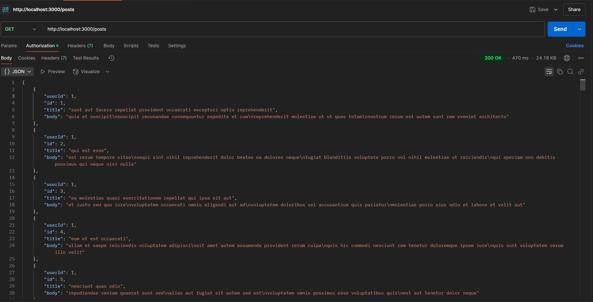
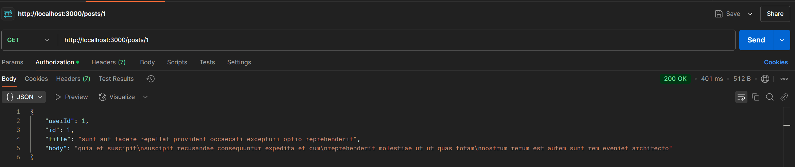

# Express API with Swagger and WebSocket

This is a simple Express server that fetches data from JSONPlaceholder and provides REST API endpoints for retrieving posts. It also includes a WebSocket for real-time communication between clients.

---

## Endpoints

### 1. **GET All Posts**
- **URL:** `/posts`
- **Method:** `GET`
- **Description:** Retrieves a list of all posts from JSONPlaceholder.
- **Example Request:**

- **Screenshot:**
  

---

### 2. **GET Post by ID**
- **URL:** `/posts/:id`
- **Method:** `GET`
- **Description:** Retrieves a single post by its ID from JSONPlaceholder.
- **Example Request:**
- **Screenshot:**
  
